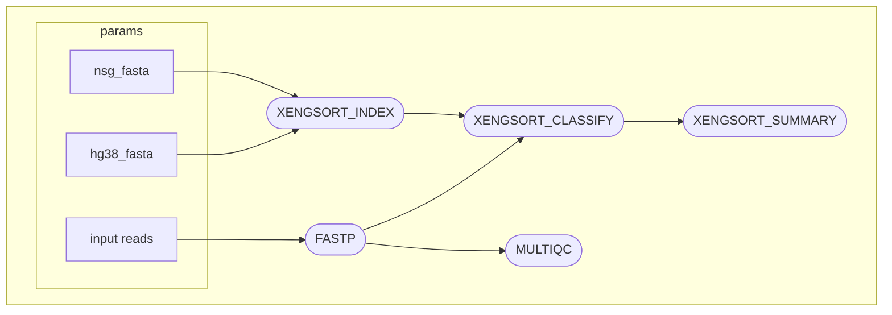

# Xengsort Nextflow Pipeline
A Nextflow pipeline to perform deconvolution of contaminant sequencing reads using Xengsort by Zentgraf and Rahmann (2021)

## Workflow

```mermaid
flowchart TB
    subgraph " "
    subgraph params
    v5["nsg_fasta"]
    v0["input reads"]
    v3["hg38_fasta"]
    end
    v2([FASTP])
    v7([XENGSORT_INDEX])
    v9([XENGSORT_CLASSIFY])
    v10([XENGSORT_SUMMARY])
    v14([MULTIQC])
    v0 --> v2
    v3 --> v7
    v5 --> v7
    v2 --> v9
    v7 --> v9
    v9 --> v10
    v2 --> v14
    end
```