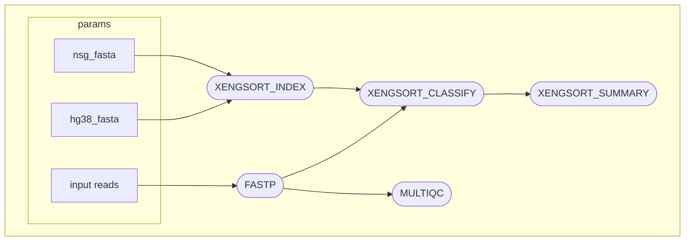

# Xengsort Nextflow Pipeline
A Nextflow pipeline to perform deconvolution of contaminant sequencing reads using Xengsort by Zentgraf and Rahmann (2021)

This tool is assay-agnostic! Meaning you can provide fastq.gz files generated from WES/WGS, RNAseq, ATACseq, etc.

## Workflow


## Running Pipeline

Instead of cloning the entire repository, you can simply run v.1.0.0 from the command line
```bash
nextflow run tylergross97/nextflow_xengsort main.nf \
    --input /path/to/samplesheet.csv \
    --outdir_base /path/to/output/directory/base \
    --hg38_fasta /path/to/human/reference/genome.fa \
    --nsg_fasta /path/to/nsg_mouse/reference/genome.fa \
    -profile docker_or_singularity
```
### Inputs

#### Samplesheet
```bash
sample,fastq1,fastq2
sample1,/path/to/sample1_R1.fastq.gz,/path/to/sample1_R2.fastq.gz
sample2,/path/to/sample2_R1.fastq.gz,/path/to/sample2_R2.fastq.gz
```

#### Reference genomes
In the case of PDX models with NSG mice, it is recommended to use the NSG-adapted mouse reference genome from [Hynds et al. (2024)](https://www.nature.com/articles/s41467-024-47547-3) by running the following bash command:
```bash
curl -O https://zenodo.org/records/10304175/files/nsg_adapted_reference.zip?download=1
mv 'nsg_adapted_reference.zip?download=1' nsg_adapted_reference.zip
unzip nsg_adapted_reference.zip
cd nsgReference/
ls
```
- You can then specify the path of mm10.nsgSpike.fa for the --nsg_fasta command line argument

### Outputs
You will find the trimmed, human-only filtered reads in ${outdir_base}/fastp/human_trimmed_{1,2}.fastq.gz - these can be then be used as input into pipelines that require uncontaminated reads, such as nf-core/sarek or nf-core/rnaseq

If you want to explore mouse contamination, refer to ${outdir_base}/xengsort/xengsort_summary.csv, which will contain sample-level contamination information
