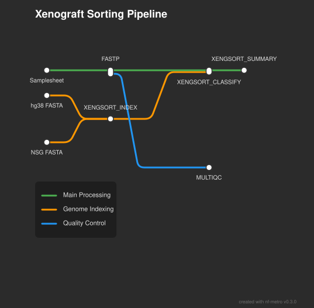

# Xengsort Nextflow Pipeline

[](https://www.nextflow.io/)
[](https://www.docker.com/)
[](https://sylabs.io/docs/)

A Nextflow DSL2 pipeline for separating human and mouse sequencing reads from Patient-Derived Xenograft (PDX) samples using [Xengsort](https://gitlab.com/genomeinformatics/xengsort) (Zentgraf and Rahmann, 2021).

## 🎯 Overview

When tumor samples from PDX models (human tumors grown in immunocompromised mice) are sequenced, the resulting data contains a mixture of:
- 🧬 **Human reads** (from the transplanted tumor)
- 🐭 **Mouse reads** (from the host tissue)

This pipeline cleanly separates these reads, providing contamination-free human sequences for downstream analysis.

### ✨ Key Features

- **Assay-agnostic**: Works with WGS, WES, RNA-seq, ATAC-seq, ChIP-seq, and other NGS data
- **Fast & accurate**: Leverages Xengsort's k-mer based classification
- **Quality control**: Integrated FASTP for read trimming and QC
- **Comprehensive reports**: MultiQC aggregation and contamination statistics
- **Production-ready**: Docker and Singularity support for reproducibility
- **NSG-optimized**: Compatible with NSG-adapted mouse reference genome

## Workflow



## 🚀 Quick Start

Run the pipeline directly from GitHub (no cloning required):

```bash
nextflow run tylergross97/nextflow_xengsort \
    --input samplesheet.csv \
    --outdir_base results \
    --hg38_fasta /path/to/GRCh38.fa \
    --nsg_fasta /path/to/mm10.nsgSpike.fa \
    -profile docker
```

### Prerequisites

- **Nextflow** ≥25.04.0 ([installation guide](https://www.nextflow.io/docs/latest/getstarted.html))
- **Docker** or **Singularity** for containerization
- **Reference genomes**: Human (GRCh38/hg38) and Mouse (see below)
## 📥 Input Requirements

### 1. Samplesheet (CSV format)

Create a comma-separated file with three columns:

| Column | Description |
|--------|-------------|
| `sample` | Unique sample identifier |
| `fastq1` | Path to R1 FASTQ file (gzipped) |
| `fastq2` | Path to R2 FASTQ file (gzipped) |

**Example:**
```csv
sample,fastq1,fastq2
PDX_001,/data/PDX_001_R1.fastq.gz,/data/PDX_001_R2.fastq.gz
PDX_002,/data/PDX_002_R1.fastq.gz,/data/PDX_002_R2.fastq.gz
PDX_003,/data/PDX_003_R1.fastq.gz,/data/PDX_003_R2.fastq.gz
```

> **Note**: Files must be paired-end Illumina reads in gzipped FASTQ format

### 2. Reference Genomes

#### Human Reference (Required)
- **GRCh38/hg38** (recommended) or GRCh37/hg19
- Download from [NCBI](https://www.ncbi.nlm.nih.gov/genome/guide/human/) or [UCSC](https://hgdownload.soe.ucsc.edu/goldenPath/hg38/bigZips/)

#### Mouse Reference (Required)

For **NSG mice** (most common PDX host), use the NSG-adapted reference from [Hynds et al. (2024)](https://www.nature.com/articles/s41467-024-47547-3):

```bash
# Download NSG-adapted mouse reference
wget https://zenodo.org/records/10304175/files/nsg_adapted_reference.zip
unzip nsg_adapted_reference.zip
cd nsgReference/

# Use mm10.nsgSpike.fa for --nsg_fasta parameter
```

For **other mouse strains**, use standard mm10/mm39 from [NCBI](https://www.ncbi.nlm.nih.gov/genome/guide/mouse/) or [UCSC](https://hgdownload.soe.ucsc.edu/goldenPath/mm10/bigZips/).

## 📤 Output Files

The pipeline generates the following output structure:

```
results/
├── fastp/
│   ├── {sample}_trimmed_1.fastq.gz     # Human-only R1 reads (use these!)
│   ├── {sample}_trimmed_2.fastq.gz     # Human-only R2 reads (use these!)
│   ├── {sample}_fastp.json             # FASTP QC metrics
│   └── {sample}_fastp.html             # FASTP QC report
├── xengsort/
│   ├── {sample}.xengsort.txt           # Per-sample classification
│   ├── xengsort_summary.csv            # Aggregate contamination stats
│   └── xengsort_index.*                # Index files (can be reused)
└── multiqc/
    └── multiqc_report.html             # Aggregated QC report
```

### Key Output Files

| File | Description | Use For |
|------|-------------|---------|
| `fastp/*_trimmed_{1,2}.fastq.gz` | **Clean human reads** | Downstream analysis (variant calling, RNA-seq, etc.) |
| `xengsort/xengsort_summary.csv` | Contamination statistics | QC and sample evaluation |
| `multiqc/multiqc_report.html` | Comprehensive QC report | Overall run assessment |

### Downstream Integration

The clean human reads can be directly used as input for:
- **Variant calling**: [nf-core/sarek](https://nf-co.re/sarek)
- **RNA-seq analysis**: [nf-core/rnaseq](https://nf-co.re/rnaseq)
- **ATAC-seq analysis**: [nf-core/atacseq](https://nf-co.re/atacseq)
- **Custom pipelines**: Any analysis requiring human-only reads

## 🧪 Testing

Test the pipeline installation with a minimal dataset:

```bash
nextflow run tylergross97/nextflow_xengsort -profile test,docker
```

This runs with:
- Pre-configured test data (3 small samples)
- Reduced memory requirements
- ~5 minute runtime
- Outputs to `results_test/` directory

## ⚙️ Parameters

### Required Parameters

| Parameter | Description |
|-----------|-------------|
| `--input` | Path to samplesheet CSV file |
| `--outdir_base` | Base output directory |
| `--hg38_fasta` | Path to human reference genome (FASTA) |
| `--nsg_fasta` | Path to mouse reference genome (FASTA) |

### Optional Parameters

| Parameter | Default | Description |
|-----------|---------|-------------|
| `--outdir_references` | `${outdir_base}/references` | Reference output directory |
| `--outdir_fastp` | `${outdir_base}/fastp` | FASTP output directory |
| `--outdir_xengsort` | `${outdir_base}/xengsort` | Xengsort output directory |
| `--outdir_multiqc` | `${outdir_base}/multiqc` | MultiQC output directory |

### Profiles

Choose a container platform:

```bash
# Docker (recommended for local systems)
-profile docker

# Singularity (recommended for HPC)
-profile singularity

# Test with minimal data
-profile test,docker
```

## 💻 Usage Examples

### Basic Usage

```bash
nextflow run tylergross97/nextflow_xengsort \
    --input samplesheet.csv \
    --outdir_base ./pdx_results \
    --hg38_fasta /references/GRCh38.fa \
    --nsg_fasta /references/mm10.nsgSpike.fa \
    -profile docker
```

### HPC with Singularity

```bash
nextflow run tylergross97/nextflow_xengsort \
    --input samplesheet.csv \
    --outdir_base /scratch/user/pdx_analysis \
    --hg38_fasta /refs/hg38.fa \
    --nsg_fasta /refs/mm10_nsg.fa \
    -profile singularity \
    -resume
```

### Resume Failed Run

```bash
nextflow run tylergross97/nextflow_xengsort \
    --input samplesheet.csv \
    --outdir_base ./results \
    --hg38_fasta /refs/hg38.fa \
    --nsg_fasta /refs/mm10.fa \
    -profile docker \
    -resume  # Continues from where it stopped
```

## 📊 Performance & Resource Requirements

### Typical Runtime
- **Small dataset** (3 samples, ~10M reads/sample): ~30 minutes
- **Medium dataset** (10 samples, ~50M reads/sample): ~3-5 hours
- **Large dataset** (50 samples, ~100M reads/sample): ~12-24 hours

*Note: Runtime varies based on CPU cores and read depth*

### Memory Requirements
- **FASTP**: 2-4 GB per sample
- **XENGSORT_INDEX**: 8-16 GB (one-time, reusable)
- **XENGSORT_CLASSIFY**: 32 GB per sample (scales with retries)
- **Recommended minimum**: 32 GB RAM for typical runs

## 🐛 Troubleshooting

### Common Issues

**Issue**: `xengsort classify` fails with memory error
- **Solution**: Increase memory in `nextflow.config` or use `-resume` to retry with more memory

**Issue**: Reference genome files not found
- **Solution**: Verify absolute paths and file existence for `--hg38_fasta` and `--nsg_fasta`

**Issue**: Docker/Singularity permission errors
- **Solution**: Ensure Docker daemon is running and user has appropriate permissions

**Issue**: Pipeline hangs or stalls
- **Solution**: Check disk space and network connectivity; use `-resume` to continue

### Getting Help

- **Issues**: [GitHub Issues](https://github.com/tylergross97/nextflow_xengsort/issues)
- **Questions**: Open a discussion or issue on GitHub

## 🤝 Contributing

Contributions are welcome! Please:
1. Fork the repository
2. Create a feature branch (`git checkout -b feature/amazing-feature`)
3. Commit your changes (`git commit -m 'Add amazing feature'`)
4. Push to the branch (`git push origin feature/amazing-feature`)
5. Open a Pull Request

## 📜 Citations

### Pipeline

If you use this pipeline in your research, please cite:

> **Gross, T.** (2025). *Xengsort Nextflow Pipeline* [Computer software]. https://github.com/tylergross97/nextflow_xengsort

### Dependencies

This pipeline uses the following tools that should be cited independently:

1. **Nextflow**  
   Di Tommaso, P., Chatzou, M., Floden, E. W., Barja, P. P., Palumbo, E., & Notredame, C. (2017). Nextflow enables reproducible computational workflows. *Nature Biotechnology*, 35(4), 316-319. https://doi.org/10.1038/nbt.3820

2. **Xengsort**  
   Zentgraf, J., & Rahmann, S. (2021). Fast lightweight accurate xenograft sorting. *Algorithms for Molecular Biology*, 16(1), 2. https://doi.org/10.1186/s13015-021-00181-w

3. **fastp**  
   Chen, S., Zhou, Y., Chen, Y., & Gu, J. (2018). fastp: an ultra-fast all-in-one FASTQ preprocessor. *Bioinformatics*, 34(17), i884-i890. https://doi.org/10.1093/bioinformatics/bty560

4. **MultiQC**  
   Ewels, P., Magnusson, M., Lundin, S., & Käller, M. (2016). MultiQC: summarize analysis results for multiple tools and samples in a single report. *Bioinformatics*, 32(19), 3047-3048. https://doi.org/10.1093/bioinformatics/btw354

5. **NSG Reference** (if used)  
   Hynds, R. E., Huebner, A., Pearce, D. R., Hill, M. S., Akarca, A. U., Moore, D. A., ... & Swanton, C. (2024). Representation of genomic intratumor heterogeneity in multi-region non-small cell lung cancer patient-derived xenograft models. *Nature Communications*, 15(1), 4653. https://doi.org/10.1038/s41467-024-47547-3

## 📄 License

This pipeline is released under the MIT License. See `LICENSE` file for details.

## 👤 Author

**Tyler Gross**
- GitHub: [@tylergross97](https://github.com/tylergross97)

---

**⭐ If you find this pipeline useful, please consider starring the repository!**
